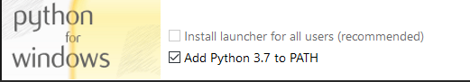

# Hosting a dedicated server

If you want to run a game server and have it show up in the server list for players who
connect to the replacement login server, follow these steps:

1. Make sure [Tribes Ascend and its prerequisites have been installed](installing_tribes_and_prerequisites.md)

2. Get the code for [this project](https://github.com/Griffon26/taserver) from github

3. Install the **x86 version** of the
   [Visual C++ Redistributable for Visual Studio 2015](https://www.microsoft.com/en-us/download/details.aspx?id=48145).
   It contains `msvcp140.dll`, which is needed by TAMods-Server and the UDP proxy used by the
   firewall script.

4. Install python 3.

    It is recommended during installation to include the py launcher (to be able to start scripts without running them 
    as python <scriptname>) and to have python added to the PATH environment variable, see below image (so you can start 
    python and pip without having to type the full path to the executables). If you don't do this then remember to specify 
    python.exe <scriptname> or even something like C:\Program Files (x86)\Python36\python <scriptname> whenever the 
    instructions tell you to run a script. The py launcher should be included by default.



5.  Install the gevent module for python. From an administrator command prompt you should be able
    to do it with:

    ```
    pip install gevent
    ```

    You may have to specify the full path. Something like:

    ```
    C:\Program Files (x86)\Python36\Scripts\pip install gevent
    ```

6.  Modify `dir` under the `[gameserver]` section in `data/gameserverlauncher.ini` to point to
    the directory where your TribesAscend.exe is located. For instance:

    ```
    C:\Games\Tribes Ascend\Binaries\Win32
    ```

7.  Open an administrator command prompt and go to the directory containing the taserver files

8.  Run the `download_compatible_controller.py` script to download the latest compatible
    version of `TAMods-Server.dll`. TAMods-Server is responsible for all game-related settings,
    including server description, message of the day and password.
    Consult the [TAMods-Server documentation](https://www.tamods.org/docs/doc_srv_api_overview.html)
    on how to change any of these.

9.  Run the `download_udpproxy.py` script to download the `udpproxy.exe` program used by the
    taserver firewall script. This is a precompiled version of the C++ source code in the `udpproxy`
    subdirectory.

10. As an administrator run `start_taserver_firewall.py` in the root of this repository. This is very
    important. This script will manage firewall rules to keep kicked players out and only allow
    logged in players on the game server. Without this script running you will not be able to get
    rid of hackers that are normally "unkickable".

    **You will need to run the firewall everytime you want to run the server.**

11. If the game server is running behind a router, you'll need to forward the following ports to
    the game server:

    -   7777/UDP
    -   7777/TCP
    -   7778/UDP
    -   7778/TCP
    -   9002/UDP

    **Do not manually open these ports in the firewall on the machine where the game server runs,
    otherwise votekick may not work correctly. taserver itself will manage the firewall rules**

    In the router, you will need to redirect those ports to the machine you are hosting the server on.
    If you don't know how to get the ip for this machine, open a command prompt and type `ipconfig` and
    check `IPv4 address`.

    _If you skip this step, no one will be able join your server._

12. Go into the

         .../taserver/data/gamesettings/ootb

    folder and open the `serverconfig.lua` file with your favorite
    text editor to change your server settings, like server name, message of the day and other
    settings. You don't need to restart the server everytime and make changes to this file.
    The settings will be applied on the next map change.

13. Open a second command prompt (doesn't need to be an administrator one) and go to the
    directory containing the taserver files.

    _You can also shift+right click an empty space in the folder containing the server files
    and select `Open PowerShell here`._

14. Start the game server launcher by running the `start_game_server_launcher.py` script in the
    root of this repository.

Your server should now show up in the list for anyone connecting to the login server.
Try it out by following the instructions under [Joining games](joining_games.md)

_Note : If you host the server on your main computer and are using TAMods,
make sure you inject it by Process ID (in the advanced tab) and not by name. Otherwise, it could accidentally inject
the server and it might crash._

### GOTY

The server is in OOTB mode by default. If you want to run it in GOTY mode instead there are two
more steps below.

1.  Run the `download_gotylike.py` script to automatically download
    [mcoot's GOTY-like server configuration](https://github.com/mcoot/tamods-server-gotylike)

2.  Edit `data/gameserverlauncher.ini` and replace:

        controller_config = data\gamesettings\ootb\serverconfig.lua

    with

        controller_config = data\gamesettings\gotylike\serverconfig.lua

Read more about GOTY and how people can join GOTY servers on
[this page](joining_goty_servers.md).

### Multiple game servers on the same machine

If you're interested in running more than one game server on a single machine then
[read here how to do that](hosting_multiple_game_servers.md).
